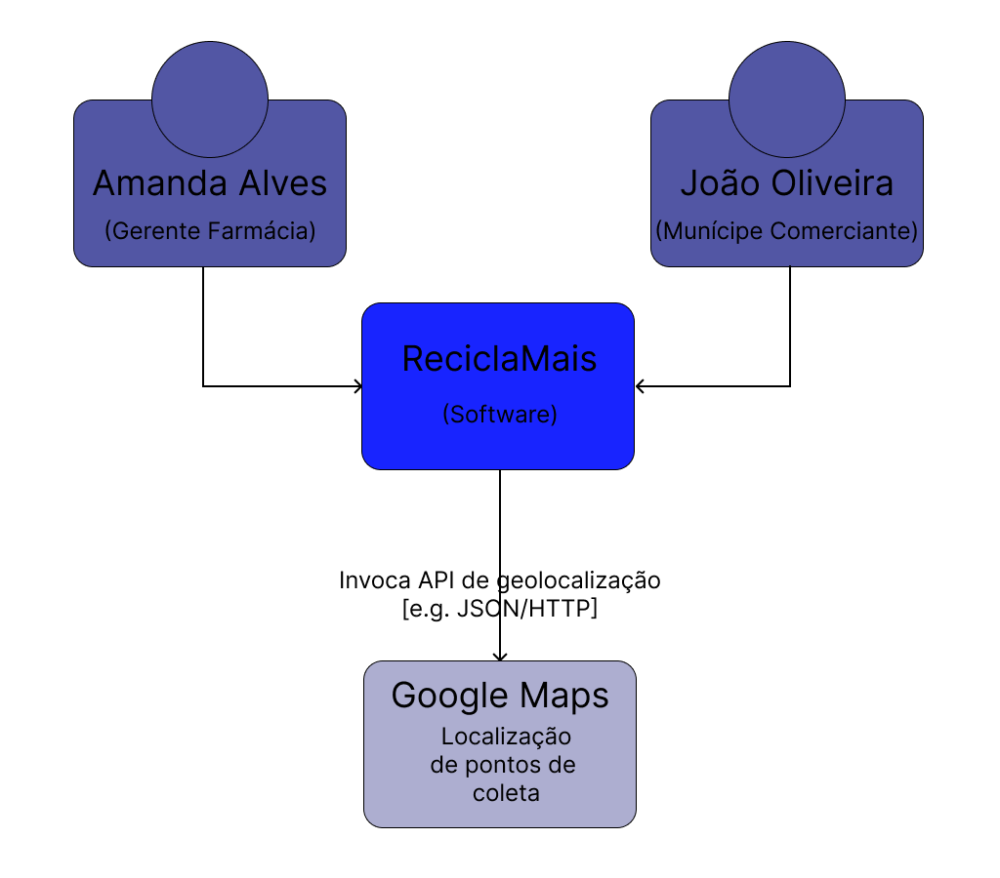

# Diagrama de Contexto

A integração do ReciclaMais com a API do Google Maps permite a recomendação de pontos de coleta de resíduos eletrônicos para os usuários. Através de requisições HTTP no formato JSON, o software pode obter informações precisas de localização e exibir os pontos de coleta mais próximos. Esse recurso é essencial para facilitar o descarte correto de eletrônicos, conectando os usuários  aos locais apropriados para a destinação sustentável dos resíduos. Dessa forma, o ReciclaMais promove a conscientização ambiental e incentiva a participação ativa da comunidade na reciclagem.

[Retorna](../README.md)
